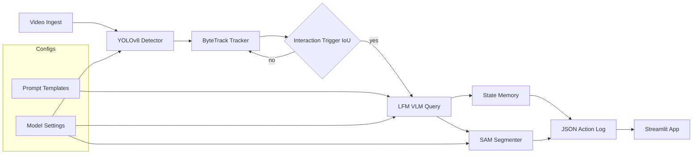

# Architecture

This diagram shows the event-triggered pipeline from video ingest to JSON Action Logs.

Key ideas:
- Fast detection and tracking runs continuously; semantic reasoning is event-triggered.
- State memory records transitions across time, enabling causal logs.
- Logs power the real-time visualization and downstream learning.
